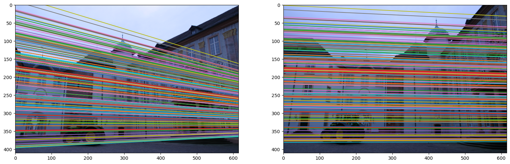
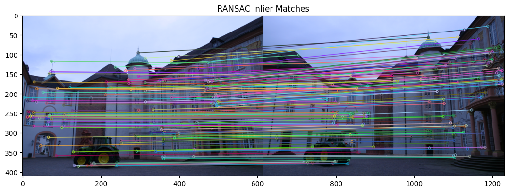
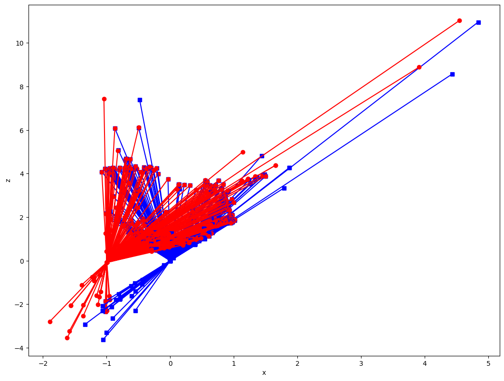

  

    <h1 align="center">Geometric Computer Vision</h1>

## Introduction
This is the part of course CIS580 Machine Perception by Prof. Kostas Danidillis at University of Pennsylvania. In this course we got introduction to geomteric computer vision techniques that are crucial and still used this days because of the real time processing. Below are the some of the major projects we did as part of learning.

### 1. Homography 

<!-- 

Forward Kinematics
 -->
<b>Direct Linear Transform (DLT) Algorithm:</b>
Implemented the DLT algorithm to compute the homography matrix. This involved normalizing the points, setting up a linear system, and solving it to find the homography matrix.

<b>Homography Decomposition:</b> Decomposed the computed homography into possible combinations of rotation, translation, and normal to the plane. This step was crucial for understanding the multiple interpretations of homography in 3D space.

Utilizing the estimated homography performed image warping to align images and created image mosaics. This part of the project demonstrated the practical application of homography in tasks like panorama stitching.

  

### 2. Augmented Reality (PnP and P3P Techniques)

<b>Establishing World Coordinate System:</b> I set up a world coordinate system, central to understanding the camera's position in the world. This involved defining the 3D world coordinates of key points.

<b>Solving PnP with Coplanar Assumption:</b> I estimated the camera pose from an AprilTag using homography estimation. This required me to reuse the homography implementation from the previous project and extend it to solve for camera pose.

<b>Perspective-Three-Point (P3P) Problem and Procrustes Problem:</b>I calculated the camera pose by first determining the 3D coordinates of the AprilTag corners in the camera frame, then solving for the camera pose using the Procrustes method.

The culmination of the project was the generation of a video that displayed virtual objects as if they existed in the real world, based on the camera poses calculated from the AprilTags.

  

### 3. Epipolar Gemotry and Depth from Two View
<b>Computing Spatiotemporal Derivatives:</b> Python functions were developed to compute the spatiotemporal derivatives for every pixel in an image sequence. Gaussian derivative approximations and convolution operations were utilized, laying the groundwork for motion analysis in image sequences.

<b>Optical Flow Field Computation:</b> A method was implemented to compute an optical flow field. This involved solving a linear system to obtain the flow components (u, v) for each pixel, providing an estimate of motion between frames in the image sequence.

<b>Visualizing Optical Flow and Epipole: </b>The optical flow vector field was visualized. This process entailed plotting the vector field at each pixel where the confidence measure exceeded a specified threshold, aiding in the interpretation of motion within the image sequence. And position of epipole was found.

  

<b>Depth Estimation from Optical Flow:</b> Depth was estimated at every pixel where optical flow was present, given the flow confidence, epipole, and intrinsic camera parameters. This required translating pixel coordinates to normalized image coordinates and then estimating the depth. The resulting depth was visualized as an image, revealing insights into the scene's 3D structure.

<table align="center">
  <tr>
    <td></td>
    <td></td>
    <td></td>
  </tr>
</table>

### 4. SfM (Structure from Motion)
<b>Estimation of the Essential Matrix: </b>The process began with the reconstruction of the scene from SIFT matches in two images. This involved using OpenCV for SIFT extraction and matching. The essential matrix was estimated using the SVD decomposition method, similar to the 8-point algorithm.

<b>RANSAC and Epipolar Lines: </b>A basic RANSAC algorithm was implemented to improve the robustness of the essential matrix estimation. This helped in eliminating outliers and spurious matchings.

<table align="center">
  <tr>
    <td>
      <figure>
        
        <figcaption>Epipolar Line</figcaption>
      </figure>
    </td>
    <td>
      <figure>
        
        <figcaption>Ransac</figcaption>
      </figure>
    </td>
  </tr>
</table>

<b>Pose Recovery and 3D Reconstruction:</b> The transformation between the two cameras was recovered, considering the possible solutions due to the twisted pair ambiguity. The correct transformation was determined by selecting the one with the highest number of reconstructed points in front of both cameras.

<b>Triangulation and 3D Point Reconstruction:</b> A least square estimation was performed to reconstruct 3D points. This involved formulating a linear system for each pair of matching points and solving for the depths.

  

---

##  License

This project is protected under the [MIT] License. For more details, refer to the [LICENSE](https://choosealicense.com/licenses/mit/) file.

---

